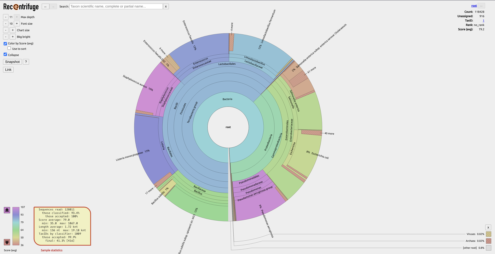

# POC metagenomics sprint

A place to start putting code and organising ideas

See:

- [Currently available pipelines/tools](./available_pipelines_tools.md)
- [Initial look at demultiplexing after Kraken (no longer doing)](./demultiplex_kraken_output.md)
- [Paper - Nanopore sequencing and its application to the study of microbial communities](https://www.sciencedirect.com/science/article/pii/S2001037021000714)

## Classification - kraken2 

We have decided upon [kraken2](https://github.com/DerrickWood/kraken2) for our initial classification needs.

The major factor for this is that we have access to ARM versions of the tool. We have access to a docker container created and maintained by Nvidia as part of their NGC ([link](https://ngc.nvidia.com/catalog/containers/nvidia:clara-agx:agx-metagenomics-classify-reference)). This works great:

```sh
$ docker run -ti -v /data/databases/:/mnt/databases/ \
> -v /data/testdata/:/mnt/testdata/ \
> -v /data/output/:/mnt/output/ \
> nvcr.io/nvidia/clara-agx/agx-metagenomics-classify-reference \
> classify \
>   -H /mnt/databases/minikraken2_v1_8GB/hash.k2d \
>   -t /mnt/databases/minikraken2_v1_8GB/taxo.k2d \
>   -o /mnt/databases/minikraken2_v1_8GB/opts.k2d \
>   /mnt/testdata/barcoded/fastq_pass/barcode26/barcode26_1k.fq \
>   -O /mnt/output/barcode26_kr2_output \
>   -R /mnt/output/barcode26_kr2_report \
>   -n
Loading database information... done.
4912 sequences (40.22 Mbp) processed in 2.777s (106.1 Kseq/m, 868.85 Mbp/m).
  4910 sequences classified (99.96%)
  2 sequences unclassified (0.04%)
```

However there are a few caveats with this:
* user requires an Nvidia Developer account (this is free to sign up for)
* once you have an account you can generate an API key
* a user then needs to install NGC CLI ([link](https://ngc.nvidia.com/setup/installers/cli))
* once NGC CLI is installed docker can be authorised and images pulled from NGC

So there are some hoops for an end user to jump through there.

BUT lucky for us @shanesturrock has been able to compile kraken2 from source for ARM. We need to do some testing but this should prove the easiest route moving forward. Regardless, we have a fully working ARM version of kraken2 to move forwards with.

### Databases

We're grabbing kraken2 databases from here: https://benlangmead.github.io/aws-indexes/k2

The database we're most interested in initially is [Minikraken v1](https://genome-idx.s3.amazonaws.com/kraken/minikraken2_v1_8GB_201904.tgz) - this is a refined database restricted to fit into 8Gb.

#### --memory-mapping

> "**Memory**: To run efficiently, Kraken 2 requires enough free memory to hold the database (primarily the hash table) in RAM. While this can be accomplished with a ramdisk, Kraken 2 will by default load the database into process-local RAM; the **--memory-mapping** switch to kraken2 will avoid doing so. The default database size is 29 GB (as of Jan. 2018), and you will need slightly more than that in RAM if you want to build the default database."

When running kraken2 on the Xavier AGX (32Gb) with the Zymo mock community test data and the `Minikraken v1` database 8Gb of system RAM is used during classification (and a single CPU thread). This is fine on the bigger AGX units which have 16/32Gb of RAM. However on the NX with it's 8Gb RAM this would mean we can run classification. That's where `--memory-mapping` comes in. This parameter gives up a little bit of performance (speed) for little to no extra RAM usage.

Here is the AGX running without `-M` (it uses 9Gb of total system RAM):
```sh
# docker kraken2 - zymo mock community data
docker run -ti \
  -v /data/databases/:/mnt/databases/ \
  -v /data/testdata/:/mnt/testdata/ \
  -v /data/output/:/mnt/output/ \
  nvcr.io/nvidia/clara-agx/agx-metagenomics-classify-reference classify \
  -H /mnt/databases/minikraken2_v1_8GB/hash.k2d \
  -t /mnt/databases/minikraken2_v1_8GB/taxo.k2d \
  -o /mnt/databases/minikraken2_v1_8GB/opts.k2d \
  /mnt/testdata/zymo_combined_shortrun.fastq \
  -O /mnt/output/zymo_mockcommunity_kr2_output \
  -R /mnt/output/zymo_mockcommunity_kr2_report \
  -n
Loading database information... done.
128012 sequences (213.35 Mbp) processed in 14.326s (536.1 Kseq/m, 893.55 Mbp/m).
  119520 sequences classified (93.37%)
  8492 sequences unclassified (6.63%)
```

Here is the AGX running with `-M` (it uses <2Gb of total system RAM):
```sh
# adding the -M (--memory-mapping) parameter to not use RAM
docker run -ti \
  -v /data/databases/:/mnt/databases/ \
  -v /data/testdata/:/mnt/testdata/ \
  -v /data/output/:/mnt/output/ \
  nvcr.io/nvidia/clara-agx/agx-metagenomics-classify-reference classify \
  -H /mnt/databases/minikraken2_v1_8GB/hash.k2d \
  -t /mnt/databases/minikraken2_v1_8GB/taxo.k2d \
  -o /mnt/databases/minikraken2_v1_8GB/opts.k2d \
  /mnt/testdata/zymo_combined_shortrun.fastq \
  -O /mnt/output/zymo_mockcommunity_kr2_output \
  -R /mnt/output/zymo_mockcommunity_kr2_report \
  -n
Loading database information... done.
128012 sequences (213.35 Mbp) processed in 17.558s (437.4 Kseq/m, 729.07 Mbp/m).
  119520 sequences classified (93.37%)
  8492 sequences unclassified (6.63%)
```

The difference in processing time is only **3 seconds** on this test data set. This is great news moving forward for lower RAM units like the NX, and maybe even the Nano.

## Visualisation 

There will be many great tools that help create awesome visualisations, here we're going for ease of installation and interpretation initially.
### recentrifuge

We thought that we'd test [recentrifuge](https://github.com/khyox/recentrifuge) for creating interactive plots. Installation was actually very simple after getting minconda set up (see [notes](jetson_xavier_setup_notes.md)).

Here is a quick run on the Zymo data set:

```sh
rcf -n /xavier_ssd/gitrepo/recentrifuge/taxdump -k zymo_mockcommunity_kr2_output.krk

=-= /xavier_ssd/miniconda3/bin/rcf =-= v1.3.3 - May 2021 =-= by Jose Manuel Martí =-=

Loading NCBI nodes... OK! 
Loading NCBI names... OK! 
Building dict of parent to children taxa... OK! 

Please, wait, processing files in parallel...

Loading output file zymo_mockcommunity_kr2_output.krk... OK!
  Seqs read: 128_011	[213.35 Mnt]
  Seqs clas: 119_519	(6.63% unclassified)
  Seqs pass: 119_519	(0.00% rejected)
  Scores SHEL: min = 35.0, max = 1067.0, avr = 79.0
  Coverage(%): min = 0.0, max = 25.5, avr = 2.8
  Read length: min = 136 nt, max = 19.18 knt, avr = 1.72 knt
  TaxIds: by classifier = 1009, by filter = 1009
Building from raw data with mintaxa = 5 ... 
  Check for more seqs lost ([in/ex]clude affects)... 
  Info: 1091 additional seqs discarded (0.913% of accepted)

  Warning! 4 orphan taxids (rerun with --debug for details)
zymo_mockcommunity_kr2_output sample OK!
Load elapsed time: 11.1 sec


Building the taxonomy multiple tree... OK!
Generating final plot (zymo_mockcommunity_kr2_output.krk.rcf.html)... OK!
Generating Excel full summary (zymo_mockcommunity_kr2_output.krk.rcf.xlsx)... OK!
Total elapsed time: 00:00:42
```

...and here is a static image of the output:



## GitHub LFS (Large File System)

Installing git-lfs: [link](https://docs.github.com/en/github/managing-large-files/versioning-large-files/installing-git-large-file-storage)
Set up: [link](https://docs.github.com/en/github/managing-large-files/versioning-large-files/configuring-git-large-file-storage)

Once set up check that it's installed:

```sh
git lfs install

Updated git hooks.
Git LFS initialized.
```

Then you can flag which files should be marked for tracking and upload to LFS:

```sh
git lfs track "*.fastq"
git lfs track "*.fq"
git lfs track "*.fq.gz"
git lfs track "*.fastq.gz"
git lfs track "*.tar.gz"
```